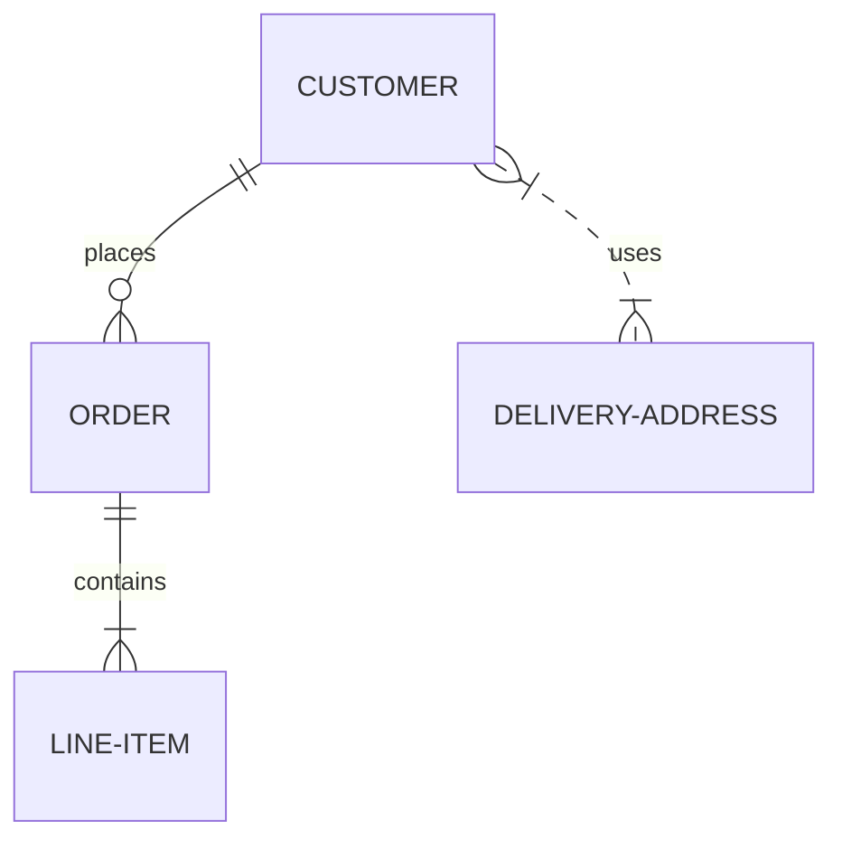
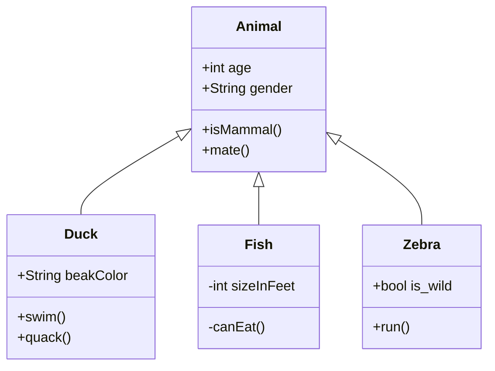

# Git-lek

## Userstory-001

```javascript
	function message () => {
		return 'Hello World'
	};
```

##  Userstory-002

```java 
	public class Main {
  		public static void main(String[] args) {
    			System.out.println("Hello World");
  		}
	}	
```

## Userstory-003


##  Userstory-004

```javascript
	let greeting = () => {
		console.log("Hello, how are you?")
	};
```

##  Userstory-005

[Click me! I'm a link to google](https://www.google.se/?hl=sv)

##  Userstory-006

|Syntax        |Description   |Example text          |
| ------------ | ------------ | -------------------- |
|#             | Header (h1)  | <h1>Title</h1>       |
|##            | Header (h2)  | <h2>Undertitle</h2>  |
|**Bold**      | Bold text    | **Bold text**        |

##  Userstory-007

Make bold text by writing ** before and after text
**This is bold!**

Make italic text by writing * before and after text
*This is italic*

## Userstory-008

This is an alien emoticon: :alien:

## Userstory-009

<p>This is an horisontal rule: </p>
---

## Userstory-010

This is a task list;
- [x] This task is completed
- [ ] This task is yet to be completed
- [ ] This is another task

## Userstory-011

This is a block quote:
> I am a block quote

## Userstory-012

This is an ER-diagram:


## Userstory-013

This is a class diagram:


